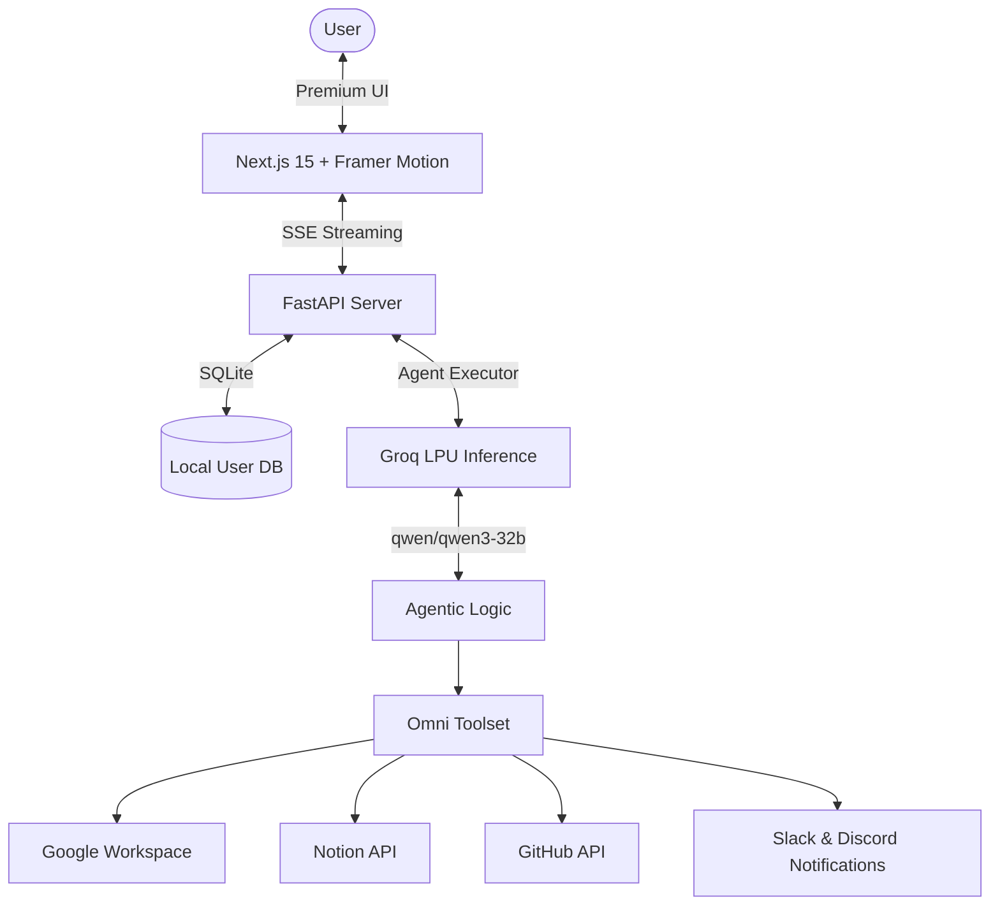

# 🤖 Omni Copilot: Premium AI Automation Workspace

<div align="center">
  
  
  
  
</div>

---

**Omni Copilot** is a high-performance, AI-powered unified workspace assistant designed to bridge the gap between conversational AI and real-world productivity. It integrates your favorite tools—Google Workspace, Notion, Slack, and GitHub—into a single, sleek, and premium interface.

🚀 **Zero Placeholders. Real Actions. Premium Aesthetics.**

---

## ✨ Key Features

### 🎨 Premium UI Overhaul
- **Animated Splash Screen**: A beautiful 5-second intro with smooth gradients and branding.
- **Modern Auth Suite**: Fully functional Signup/Login flow with first/last name support and secure local database integration.
- **Glassmorphic Design**: A state-of-the-art dark theme (#0F172A) with radiant violet-to-cyan glows and interactive elements.
- **Fluid Animations**: Powered by Framer Motion for a "living" interface that responds to every interaction.

### 🛠️ 13+ Integrated Power-Tools
- **📅 Calendar & Meetings**: Schedule events with professional descriptions and native Google Meet links.
- **💬 Multi-Channel Communication**: Read, search, and send messages across **Gmail**, **Slack**, and **Discord**.
- **📂 AI File Extraction**: Search Google Drive and extract text from PDFs directly in the chat.
- **💻 Developer Suite**: Fetch GitHub repos, list files, and track project changes.
- **📝 Notion Workspace**: Create rich-text pages and log database entries with natural language.

---

## 🏗️ Technical Architecture



---

## 🚀 Getting Started

### 1. Prerequisites
- **Python 3.9+** & **Node.js 18+**
- **API Keys**: [Groq](https://console.groq.com/), [Google Cloud](https://console.cloud.google.com/), [Notion](https://www.notion.so/my-integrations), [Slack](https://api.slack.com/), [GitHub PAT](https://github.com/settings/tokens).

### 2. Quick Setup

**Backend:**
```bash
cd backend
pip install -r requirements.txt
# Generate token.json for Google
python utils/generate_google_token.py 
# Start Server
uvicorn main:app --reload --port 8001
```

**Frontend:**
```bash
cd frontend
npm install
npm run dev
```

---

## ⚙️ Configuration

| Variable | Description |
| :--- | :--- |
| `GROQ_API_KEY` | Your Groq Cloud API Key |
| `JWT_SECRET_KEY` | Secret for secure user authentication |
| `SLACK_BOT_TOKEN` | Slack Bot OAuth Token (`xoxb-...`) |
| `NOTION_API_KEY` | Notion Internal Integration Secret |
| `GITHUB_ACCESS_TOKEN` | Personal Access Token (PAT) for GitHub |

---

## 🎨 Design Philosophy
Omni Copilot is built on the **Soft Premium** aesthetic:
- **Typography**: Inter / Outfit for high readability.
- **Palette**: Deep Dark (#0F172A) / Radiant Violet (#7C3AED) / Cyber Cyan (#06B6D4).
- **Interactions**: Subtle glows, scale transitions, and glassmorphic backdrops.

---

## 🛡️ License
MIT License. Created with ❤️ by [Gungun Chawla](https://github.com/gungun-001).
